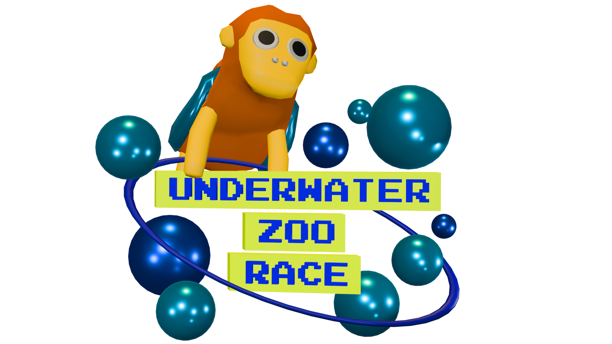

# Underwater Zoo Race

In this underwater multiplayer roguelike, take control of a drowning animal and guide it to the exit!

Your goal is simple - reach the exit before any other player does. But there are a few complications:

- You need oxygen to survive. Pick up air bubbles to fill up your oxygen meter. Every movement step drains your oxygen. If the meter reaches 0, you die 😵
- The exit needs to be opened first by using one of the switches placed on the map
- Enemy players can attack you by walking into you (and you can attack them too). Being hit removes some oxygen from each player's meter.

How to play:

- Open the webpage https://srile.github.io/ggj-2025/ (or you can create a private game by passing a `roomId` parameter to the URL, like [https://srile.github.io/ggj-2025/?roomId=ggj2025private](https://srile.github.io/ggj-2025/?roomId=ggj2025private), then share this URL with your friends!)
- Click 'Play Game'
- Wait for other players to join (or not). Up to 4 players can join one game.
- Start playing
- Be the fastest animal!
- After a player wins the round, a new map is loaded and a new round begins.
- Maps are generated randomly. Every round is a new adventure 👽

## Credits

* Christopher
* Flo
* [Oliver "oz" Z.](https://oliz.io/)

## Assets

* https://www.omabuarts.com/product/quirky-series-free-animals/
* https://www.deviantart.com/dabbex30/art/Underwater-Sand-575719072
* Bubbles2.wav by kwahmah_02 - https://freesound.org/s/261597/ - License: Attribution 3.0

## Tech

* Wonderland Engine - https://wonderlandengine.com/
* Rot.js - https://ondras.github.io/rot.js/hp/
* Websockets - https://developer.mozilla.org/en-US/docs/Web/API/WebSockets_API
* GitHub (Pages) - https://github.com/
* Render - https://render.com/